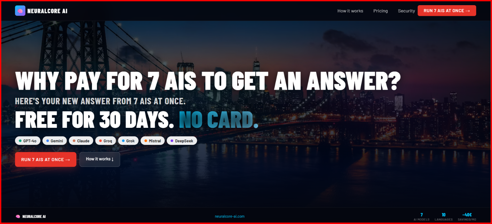

30 days of NeuralCore AI PRO free, no credit card required: https://neuralcore-ai.com

---

# 🧠 NeuralCore AI

## Don't trust just one AI. Ask 7 at once — get one answer you can trust.

**OpenAI • Claude • Gemini • Grok • Groq • DeepSeek • Mistral**

---

⭐ Star this repo if you think solo builders + AI partners can ship real products.

🌐 Website: https://neuralcore-ai.com

🚀 Launch App: https://app.neuralcore-ai.com

---

## Why I built this

NeuralCore AI runs 7 AI providers in parallel — OpenAI, Claude, Gemini, Grok,
Groq, DeepSeek and Mistral — scores their agreement, and synthesizes one
fact-checked answer, across a production platform serving 10 languages with
its own CI/CD pipeline. I built it end to end, working with Claude
(Anthropic) as my AI pair-programmer.

I'm not chasing investors or big profit — I cover the AI token costs myself.
What I wanted to prove is simple: today, a solo builder with the right AI
partner and Python can ship real production infrastructure — parallel
provider orchestration, consensus scoring, a multilingual interface — not
just a prototype. And along the way, maybe help a few people make sense of
conflicting AI answers.

**Don't trust just one AI.** NeuralCore AI sends your question to 7 AI models
at once — GPT-4o, Claude, Gemini, Grok, Groq, DeepSeek and Mistral — and shows
you where they agree. The result is one answer with a trust score, not a
guess from a single model. If one AI hallucinates, the other six reveal it.

---

## How it's different

Most "AI comparison" tools just put outputs side by side and leave the
guessing to you. NeuralCore AI goes one step further:

* Sends one prompt to all 7 providers simultaneously
* Compares their answers for agreement, not just text
* Shows a trust score based on how much the models agree
* Flags when models disagree, so you know a topic is uncertain or disputed
* Synthesizes one final answer with fact-checking and citations

Instead of guessing which AI is right, you see *where they agree* — and
that's a more honest signal than any single model's confidence.

---

## Supported AI Providers

* OpenAI (GPT-4o)
* Anthropic (Claude)
* Google (Gemini)
* xAI (Grok)
* Groq
* DeepSeek
* Mistral AI

More providers are added as they become relevant.

---

## Key Features

### 🧠 Trust Score, Not Just Comparison
See where 7 AI models agree and where they don't — with one synthesized,
fact-checked answer at the end.

### 💬 Conversation Mode
Hold full conversations with memory and context. Every follow-up builds on
previous turns while keeping the multi-model comparison.

### 🌍 Multilingual Platform
Native support for 10 languages: Slovak, Czech, English, German, Polish,
French, Russian, Spanish, Hungarian, Italian. Language is detected
automatically.

### 🔍 Real-Time Information
Integrated web search for weather, news, exchange rates and current events.

### 📄 Document & File Analysis
Work with PDF, DOCX, XLSX and images directly inside the platform.

### 📱 Mobile Friendly
Built mobile-first — most users access NeuralCore AI from a phone.

### 🔐 GDPR-Compliant, EU-Based
Operated by JGOGROUP s.r.o. (Slovakia). EU servers, encrypted connections.

---

## Pricing

| Plan     | Price        | Daily Queries | Models     |
| -------- | ------------ | -------------- | ---------- |
| Free     | €0           | 5/day          | 7 models   |
| Classic  | €9.90/month  | 25/day         | 7 models   |
| Pro      | €19.90/month | 50/day         | 7 models   |
| Business | €39.90/month | 150/day        | 7 models   |

No credit card needed for the free tier.

New accounts get full PRO access free for 30 days — no credit card required.
After the trial, you can continue on the Free plan or upgrade.

---

## Architecture

**Frontend:** Streamlit, HTML, CSS, JavaScript
**Backend:** Python — parallel provider calls, agreement scoring, fact-checking
**Infrastructure:** Linux VPS, nginx, SSL/TLS, MariaDB, GitHub Actions CI/CD

Backend source code, the consensus algorithm and infrastructure remain
private. This repository is for product presentation and documentation only.

---

## Platform Preview

### Homepage

### How It Works

### Dashboard

### AI Comparison

### Pricing

### Mobile Experience

---

## Frequently Asked Questions

**Is NeuralCore AI another AI model?**
No. It's a platform that asks 7 existing AI models at once and shows you
where they agree, with one synthesized answer and a trust score.

**Why not just use ChatGPT or Gemini directly?**
You still can — NeuralCore AI isn't a replacement, it's a check. For
questions where being wrong matters, asking 7 models is more reliable than
trusting one.

**Which AI models are supported?**
GPT-4o (OpenAI), Claude (Anthropic), Gemini (Google), Grok (xAI), Groq,
DeepSeek and Mistral.

**Is it free?**
New accounts get full PRO access free for 30 days, no credit card required.
After that, there's a permanent free tier (5 queries/day) or you can upgrade —
paid plans start at €9.90/month.

---

## Roadmap

* Additional AI providers
* Mobile app (PWA → Google Play / App Store)
* Expanded language support

---

## Project Status

| Component               | Status     |
| ------------------------ | ---------- |
| Production Platform      | ✅ Live     |
| AI Providers              | ✅ 7 Active |
| Trust Score / Consensus  | ✅ Active   |
| Conversation Mode         | ✅ Active   |
| Multilingual Interface   | ✅ Active (10 languages) |
| Subscription System       | ✅ Active   |
| Mobile Support            | ✅ Active   |

---

## Recent Updates

## v0.7.2
- Fixed weather lookups for a number of Czech and Polish cities that weren't recognized when asked about using a naturally inflected form of the city name (the way you'd normally phrase it in a sentence, not the dictionary form) — you'll now get the correct forecast in more of these cases instead of "no data available."

## v0.7.1
- The assistant now always answers in the language you asked your question in, no matter which interface language you have selected — so you no longer need to switch your UI language just to get an answer in the language you actually want.

## v0.5.0
- We now track a single, always-current version number across the whole platform, shown in the app footer — so it's always clear exactly which build you're using.

**Reliability & Accuracy**
- Added a new safety check that catches cases where our synthesized "best answer" doesn't fully match what the individual AI models actually said — when that happens, you now get the most trustworthy individual model's answer instead of a blended one that could be inaccurate.
- Fine-tuned that safety check further so it no longer second-guesses a correct combined answer by mistake, and improved it to prefer whichever individual model was honest about its own uncertainty over one that just sounded confident.
- Improved filtering of web search results used to inform answers, so results unrelated to your question are ignored instead of being echoed as fact.
- Fixed a bug where weather questions for certain cities could return data for the wrong location in some languages — you'll now get an honest "no data available" instead of the wrong city's forecast.
- Fixed a rare issue where fact-checking could silently time out on long answers; it now retries automatically.
- Significantly improved automatic language detection accuracy, especially for Czech and French text.
- General backend stability and performance improvements to reduce response delays under load.

**Conversation Mode**
- Fixed an issue where refreshing the page could reset your ongoing conversation — your chat history and context are now automatically restored.
- The assistant now remembers more of your conversation history for better, more consistent follow-up answers.
- Fixed cases where the assistant could invent personal details (like a name or location) after conversation context had been lost — it now honestly says it doesn't know instead of guessing.

**Sign-in & Accounts**
- Added Google Sign-In for faster account creation and login.
- Fixed an issue where some users could be unexpectedly logged out after refreshing the page or closing the browser tab.

**Pricing**
- Every plan, including the free tier, now includes all 7 AI models — plans differ only by how many questions you can ask per day.

**Interface**
- Fixed the message input box so pressing Enter reliably sends your message, with correct display across all devices and screen themes.
- Refreshed the app layout with a cleaner top bar and account menu, and a more compact mobile view.
- Added a rotating status message while your question is being compared across all 7 models.
- Fixed a technical issue that could prevent "Add to Home Screen" and offline-readiness features from loading correctly in some browsers.

---

## Community

🌐 Website: https://neuralcore-ai.com
🚀 Application: https://app.neuralcore-ai.com
💼 LinkedIn: https://www.linkedin.com/company/neuralcoreai
📘 Facebook: https://www.facebook.com/neuralcoreai
🐙 GitHub: https://github.com/kelt14-debug/neuralcore-ai-public

---

## About

NeuralCore AI was built solo, in Slovakia, working with Claude as an AI
pair-programmer — from parallel multi-provider orchestration and
agreement/trust scoring to a 10-language interface and production CI/CD on a
Linux VPS. Not a funded startup — a working proof that today, the right AI
partner and Python let a solo builder ship real production infrastructure.

**Don't trust just one AI. Ask 7 — get one answer you can trust.**

Built in Slovakia 🇸🇰 — by Július, JGOGROUP s.r.o.

---

## License

Copyright © 2025–2026 JGOGROUP s.r.o. All rights reserved.

This repository is intended for product presentation, documentation and
public information purposes only. No rights to the underlying proprietary
platform, source code, algorithms, infrastructure or commercial systems are
granted.
