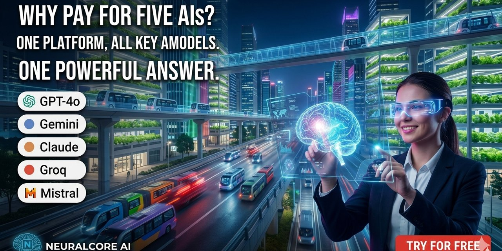
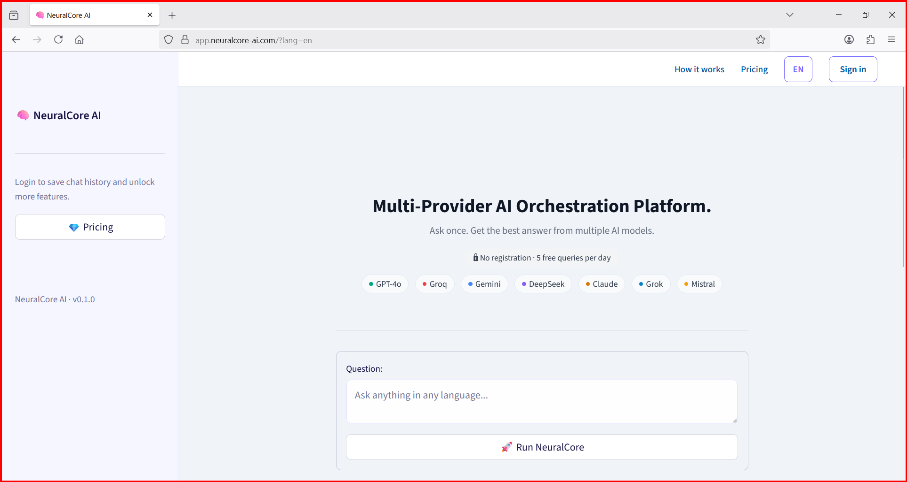
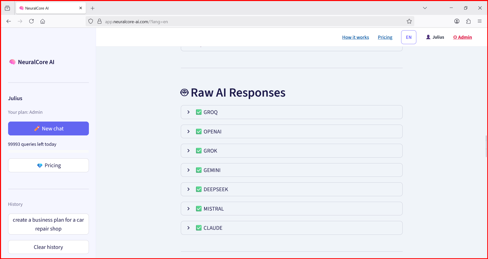
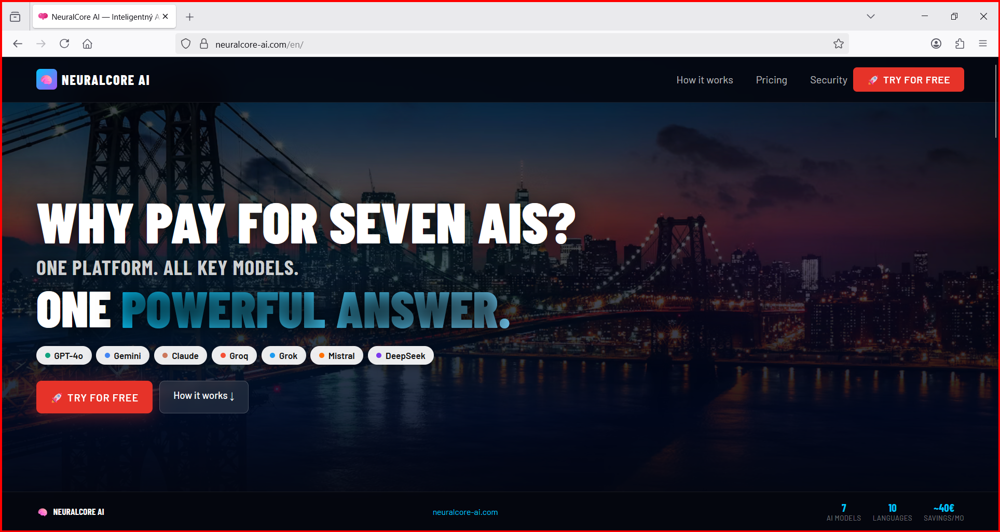
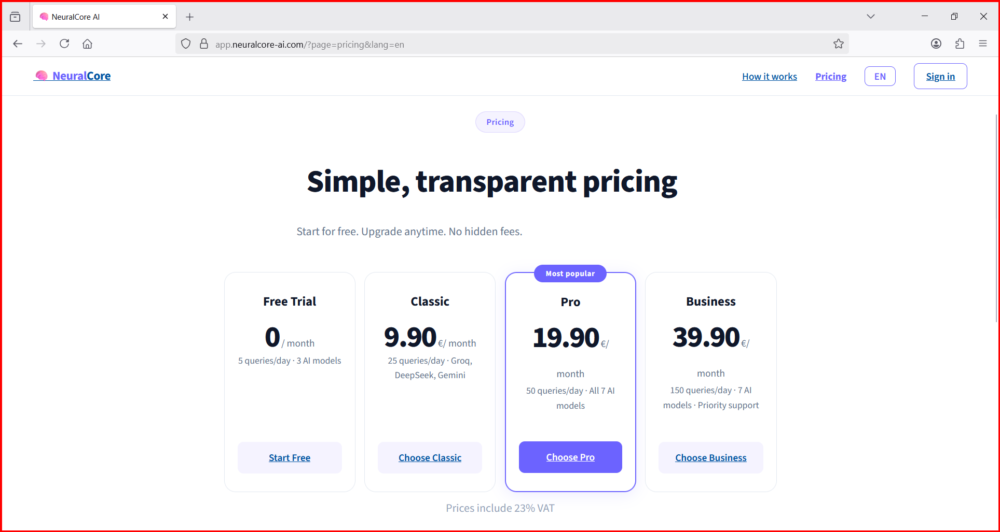
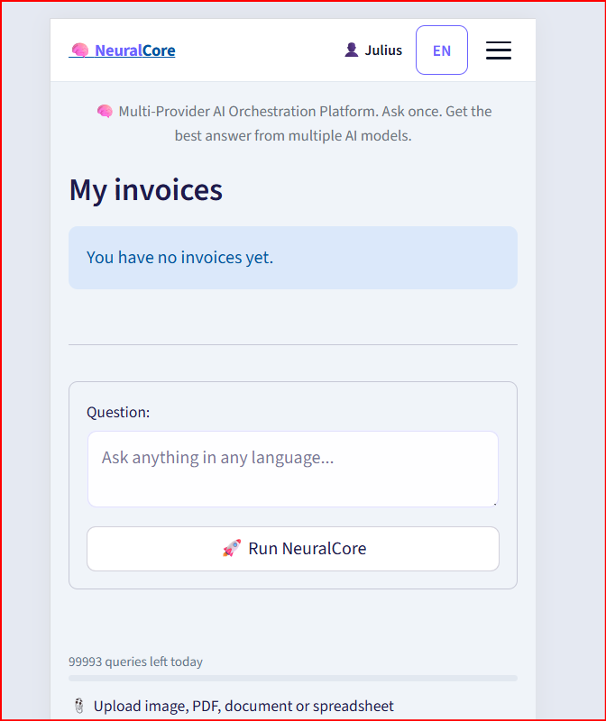

# NeuralCore AI
# 🧠 NeuralCore AI
## Compare ChatGPT, Claude, Gemini, Grok and DeepSeek in One AI Platform
> **Ask Once. Compare Multiple AI Models. Get One Trusted Answer.**

---
🌐 Website: https://neuralcore-ai.com

🚀 Start Free: https://app.neuralcore-ai.com

💡 Save money on multiple AI subscriptions. Compare ChatGPT, Claude, Gemini, Grok and DeepSeek from a single platform.

# One Question. Five AI Models. One Trusted Answer.

NeuralCore AI is a multi-model AI platform that lets you compare responses from leading AI systems in a single workspace.

Instead of switching between ChatGPT, Claude, Gemini, Grok and DeepSeek, NeuralCore AI delivers responses from multiple providers through one interface, helping users save time, reduce subscription costs and make more informed decisions.

🌐 Website: https://neuralcore-ai.com

🚀 Application: https://app.neuralcore-ai.com

---

# Why NeuralCore AI?

Modern AI users often need to compare multiple models before trusting an answer.

NeuralCore AI helps by:

* Comparing multiple AI responses in one place
* Reducing the need for multiple subscriptions
* Providing transparent answer comparison
* Saving time when researching complex topics
* Supporting multilingual workflows

---

# Supported AI Models

* OpenAI GPT
* Anthropic Claude
* Google Gemini
* xAI Grok
* DeepSeek

More providers are continuously being added.

---

# Key Features

### 🤖 Multi-Model Comparison

Compare answers from multiple leading AI providers simultaneously.

### 🌍 Multilingual Platform

Native support for 10 languages including English, Slovak, Czech, German, Polish, Hungarian, French, Italian, Russian and Spanish.

### 🔍 Real-Time Information

Access up-to-date information through integrated web search capabilities.

### 📄 Document & File Analysis

Work with documents, PDFs, spreadsheets and images directly inside the platform.

### 📱 Mobile Friendly

Use NeuralCore AI on desktop, tablet or mobile devices.

### 🔐 Secure Access

Account-based access with multiple subscription plans.

---

# Platform Preview

## Dashboard

## AI Model Comparison

## Homepage

## Pricing

## Mobile Experience

---

# Pricing

| Plan     | Price        | Daily Queries |
| -------- | ------------ | ------------- |
| Free     | €0           | 5/day         |
| Classic  | €9.90/month  | 25/day        |
| Pro      | €19.90/month | 50/day        |
| Business | €39.90/month | 150/day       |

---

# Typical Use Cases

* Business Research
* Market Analysis
* Software Development
* Content Creation
* Education
* Technical Documentation
* AI Answer Verification
* Document Analysis

---

# Roadmap

* Additional AI Providers
* Enhanced Collaboration Features
* Mobile Application
* Advanced Business Tools
* Enterprise Integrations
* Expanded Language Support

---

# Project Status

| Component              | Status   |
| ---------------------- | -------- |
| Production Platform    | ✅ Live   |
| AI Providers           | ✅ Active |
| Multilingual Interface | ✅ Active |
| Subscription System    | ✅ Active |
| Mobile Support         | ✅ Active |

---

# About NeuralCore AI

NeuralCore AI is designed for users who want the benefits of multiple AI systems without managing multiple separate platforms.

One platform. Multiple AI models. Better decisions.

🌐 https://neuralcore-ai.com

🚀 https://app.neuralcore-ai.com

📘 https://facebook.com/neuralcore-ai

---

# License

Copyright © 2026 JGOGROUP s.r.o.

All rights reserved.

This repository is intended for product presentation, documentation and public information purposes. No rights to the underlying proprietary platform, source code, algorithms or infrastructure are granted.

---

Built in Slovakia 🇸🇰
